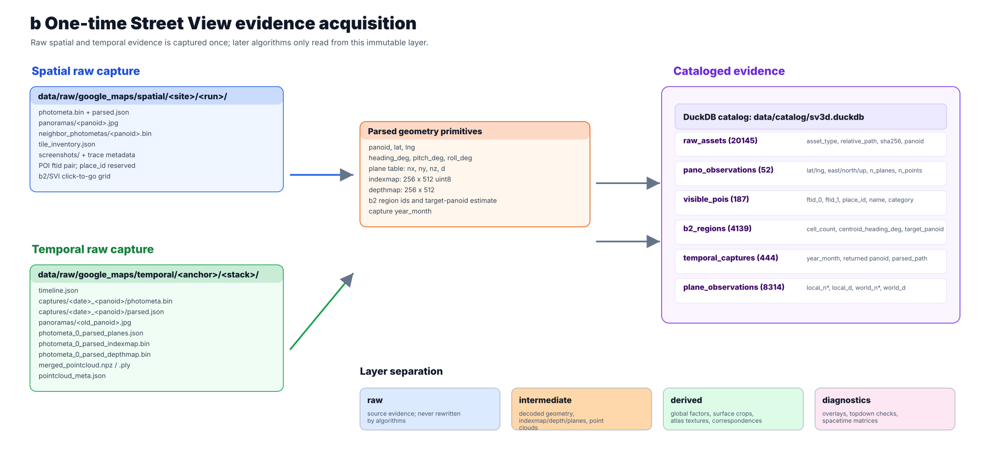
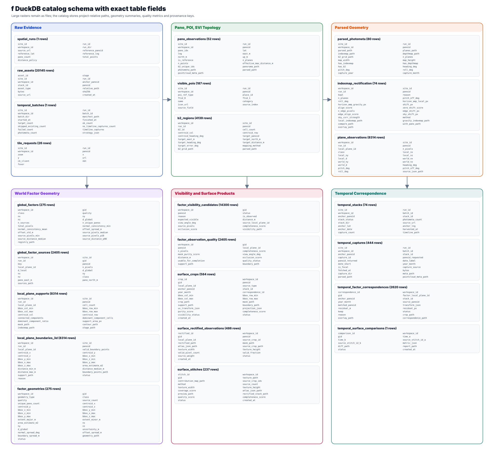

## Abstract

Street View time series are difficult to compare at the image level. Historical panoramas are not captured from identical positions, and full-image change can mix urban change with viewpoint drift, perspective distortion, vegetation, vehicles, lighting and capture artifacts. This paper develops a surface-level alternative. The unit of analysis is a stable world-space surface factor, such as a facade plane or shopfront segment, rather than a panorama.

The workflow uses Google Street View photometa as geometric evidence. Each panorama pixel is assigned to a local plane through an indexmap. Each assigned pixel defines a ray, intersects a plane equation, and becomes a colored 3D sample. Camera pose and geolocation transform local plane observations into an east-north-up world frame. Repeated observations from multiple panoramas are clustered into global surface factors. Each factor is then assigned a canonical surface atlas, allowing current and historical panoramas to be projected into a common two-dimensional plane.

The test site is Ghim Moh Market and Food Centre in Singapore. The catalog contains 52 spatial panorama observations, 4.20 million colored 3D samples, 8,314 local plane observations, 275 global factors and 444 temporal captures from 74 panorama timelines. Among 166 facade factors, the temporal projection stage evaluated 3,507 candidate cells and accepted 2,421. A high-resolution rerun of the 30 most temporally complete facade factors evaluated 1,242 cells and accepted 1,189. The top-ranked factor was observed from four source panos across 13 calendar years, with 50 accepted cells and a median valid support fraction of 0.852. The result is a space-time surface matrix in which rows are current viewpoints, columns are historical captures, and cells are rectified visual evidence for the same physical surface.

The method does not claim surveyed ground truth. It provides a reproducible geometric index over hidden Street View metadata, with explicit uncertainty from missing captures, quantized indexmaps, pose error, occlusion and planar approximation.

{#fig-concept width="100%"}

## Introduction

Street View has become a practical record of urban form. Its strength is visual coverage: facades, shopfronts, road surfaces and temporary objects are recorded repeatedly across space and time. Its weakness is geometric instability. A panorama is a spherical image captured from one camera position. A historical panorama at the same address may differ in position, heading, pitch, roll, focal exposure and foreground occlusion. An image-level comparison can therefore register many kinds of difference that are not surface change.

This project starts from a different object. The target is not an image and not a whole panorama. The target is a physical surface in world space. A panorama is treated as one observation of that surface. Several panos may see the same facade from different viewpoints. Several historical captures may see the same facade at different dates. If those observations can be projected into the same metric surface coordinate system, the comparison becomes surface-level rather than image-level.

Google Street View photometa provides the geometric signal needed for this shift. The retrieved metadata contains camera pose, geolocation, a categorical indexmap, depth-related data, local plane equations and b2 click-to-go regions. The indexmap assigns low-resolution panorama cells to plane ids. The plane table gives a local equation for each surface component. Together, they allow a pixel ray to be intersected with a plane. A pixel can therefore be interpreted as a geometric observation.

The contribution is a reproducible workflow that turns hidden Street View geometry into a surface-temporal evidence matrix. The workflow has five design commitments. Raw data are preserved as source evidence. Parsing and geometry reconstruction are isolated because these algorithms can improve. Derived surface factors are stored separately from raw evidence because they encode matching assumptions. Diagnostics are produced at every stage because geometry errors are visible before they are statistical. A DuckDB catalog indexes files, parameters, geometry summaries, correspondences and quality metrics so that the final figure can be traced back to raw photometa.

## Results

### Hidden geometry turns panoramas into surface observations

The data acquisition stage was run as a single evidence collection task for the site. It retrieved spatial panoramas, neighbor photometa, panorama tiles, parsed metadata, b2/SVI click-to-go grids, POI ftid pairs, and temporal photometa for historical captures. Temporal harvesting then retrieved each available capture timeline and per-capture geometry. The raw layer is not rewritten by later algorithms.

{#fig-acquisition width="100%"}

The fields that support the surface-temporal workflow are not interchangeable. Identity fields define what was observed. Pose fields define how local geometry relates to the world. The indexmap and plane table define how pixels relate to 3D surfaces. Temporal fields define whether a surface can be compared across years. POI and b2 fields are not required for plane recovery, but they provide useful topological context for later spatial interpretation.

| Field or asset | Example source file | Format | Downstream use |
|---|---|---|---|
| `panoid` | `parsed.json`, `timeline.json`, `meta.json` | string | Links a panorama, a timeline capture and catalog rows |
| `lat`, `lng` | `parsed.json`, `pointcloud_meta.json` | double degrees | Converts pano position into local ENU coordinates |
| `heading_deg`, `pitch_deg`, `roll_deg` | parsed photometa | degrees | Builds the local-to-world rotation matrix |
| plane table `(nx, ny, nz, d)` | `photometa_0_parsed_planes.json` | float rows | Defines local planar components |
| indexmap | `photometa_0_parsed_indexmap.bin` | `256 x 512` uint8 | Assigns each geometry cell to a local plane id |
| depthmap | `photometa_0_parsed_depthmap.bin` | `256 x 512` binary | Baseline 3D signal and cross-check against plane inference |
| b2/SVI grid | parsed b2 binary or catalog `b2_regions` | categorical grid | Infers click-to-go target regions and pano neighborhood topology |
| panorama JPG | `panoramas/<panoid>.jpg` | equirectangular RGB | Samples color for 3D points and surface atlas textures |
| POI ftid pair | `visible_pois` catalog rows | two integer-like strings | Links pano observations to nearby place references |
| `year_month` | temporal capture metadata | `YYYY-MM` | Organizes historical captures for surface projection |

The current catalog indexes 20,145 raw assets. It includes 52 spatial pano observations, 187 POI references, 4,139 b2 regions and 444 temporal captures from 74 temporal stacks. These records are enough to query the acquisition state without inspecting image folders.

### Pixel-plane decoding produces metric 3D evidence

The geometry parser converts photometa into an indexmap, a plane table, pose fields and auxiliary b2/depth layers. For a geometry grid of height \(H=256\) and width \(W=512\), row \(i\) and column \(j\) define a spherical ray:

$$
\theta_{ij}=\frac{j+0.5}{W}2\pi-\pi,\qquad
\phi_{ij}=\frac{\pi}{2}-\frac{i+0.5}{H}\pi
$$

$$
\mathbf r_{ij}=
\begin{bmatrix}
\sin\theta_{ij}\cos\phi_{ij}\\
\cos\theta_{ij}\cos\phi_{ij}\\
\sin\phi_{ij}
\end{bmatrix}.
$$

Here \(i,j\) are indexmap cell coordinates, \(H,W\) come from the decoded indexmap, \(\theta\) is the horizontal equirectangular angle, \(\phi\) is elevation, and \(\mathbf r_{ij}\) is a unit direction in the local panorama coordinate system. This is implemented in `TEST/src/py/raw/build_rgb_pointcloud.py`.

The indexmap selects a plane id:

$$
k=I(i,j),
$$

where \(I\) is the categorical indexmap. Plane row \(k\) provides \((\mathbf n_k,d_k)\), with \(\mathbf n_k=(n_{x,k},n_{y,k},n_{z,k})\). The ray-plane intersection is:

$$
t_{ij}=\frac{d_k}{\mathbf n_k^\top \mathbf r_{ij}},\qquad
\mathbf x_{ij}^{local}=t_{ij}\mathbf r_{ij}.
$$

The implementation keeps finite intersections with positive distance and applies a distance cap to avoid unstable far-field samples. The RGB color is sampled from the same equirectangular location in the panorama JPG. The derived record is \((x,y,z,r,g,b,k,panoid)\). In the current spatial run this produces 4,197,501 colored 3D samples.

{#fig-decoding width="100%"}

The indexmap overlay is the first reliability check. Plane boundaries should follow image structures such as building edges, road surfaces and sky/building separation. It is not enough for the point cloud to look plausible after reconstruction; the categorical support must align with the RGB evidence before the plane table is used for factor matching.

### Local planes are transformed into a shared world frame

The local coordinate frame differs for each pano. A facade plane from one pano cannot be compared with a facade plane from another until both are expressed in a common frame. Pano geolocation is first converted to a local east-north-up approximation relative to a reference pano:

$$
e=(lng-lng_0)\cdot111320\cos(lat_0),\qquad
n=(lat-lat_0)\cdot110540.
$$

The implementation uses \(lat_0\) in radians inside the cosine. The variables \(lat,lng\) come from parsed photometa or pointcloud metadata. The reference \(lat_0,lng_0\) comes from the spatial run.

Pose fields define the rotation. The implemented convention uses local axes \(+x\) right, \(+y\) forward and \(+z\) up, and world axes \(+x\) east, \(+y\) north and \(+z\) up. With heading \(h\), pitch \(p\) and roll \(r\), all in degrees, the rotation is:

$$
\mathbf R=R_z(-h)R_x(p-90^\circ)R_y(r).
$$

This is the `build_rotation` implementation in `TEST/src/py/diagnostics/filter_and_rectify.py`. The \(-h\) term follows the Street View convention in which heading is measured clockwise from north. The \(p-90^\circ\) term follows the pitch convention observed in the parsed metadata. Roll is applied about local \(+y\).

For a local plane

$$
(\mathbf n^{local})^\top \mathbf x^{local}=d^{local},
$$

and world point

$$
\mathbf X=\mathbf R\mathbf x^{local}+\mathbf p_{pano},
$$

the translated world plane is:

$$
\mathbf n^{world}=\mathbf R\mathbf n^{local},
\qquad
d^{global}=d^{local}+(\mathbf n^{world})^\top \mathbf p_{pano}.
$$

The file `derive_planes_world.py` writes rotation-only world plane normals and keeps \(d\) unchanged for the pure rotation stage. Factor matching and temporal residuals use the translated global offset once \(\mathbf p_{pano}\) is known. This distinction matters because a rotation-only plane table is a per-pano geometric primitive, while \(d^{global}\) is the quantity that makes planes comparable across pano positions.

{#fig-world width="100%"}

The current catalog records 8,314 plane observations. Each row stores the local normal and offset, the world normal and offset, plane class, pano pose and source JSON path. This makes the geometry layer auditable at the level of individual local planes.

### Multi-pano matching creates stable surface factors

A single pano usually sees only part of a surface. Trees, vehicles, view angle and distance can remove support. Multi-pano aggregation addresses this by treating several local planes as observations of the same physical factor when they are geometrically compatible.

For two candidate plane observations \(a\) and \(b\), the main residuals are:

$$
\alpha=\cos^{-1}\left(|\mathbf n_a^\top \mathbf n_b|\right),
\qquad
\Delta d=|d_a-d_b|.
$$

The absolute dot product makes the normal comparison invariant to sign. Candidate matches are also constrained by class, spatial proximity, source support and repeated observation. The current factor registry contains 275 factors: 166 facade, 92 ground and 17 ceiling factors. The sources table links each factor back to its panoid and local plane id.

Topological plots make the factor concept inspectable. The first-ranked temporal facade factor, `gid_0011`, has 32 source observations from 30 unique panos. Its global normal is approximately \((0.975,0.222,0.000006)\), its global offset spread is 0.437 m, and its sources concentrate along the same facade line. The topology plot also records POI references observed from source panos, showing how the factor can later be connected to place-level context.

{#fig-topology width="100%"}

The factor is not treated as ground truth. It is a derived object supported by normal agreement, offset agreement, class consistency and repeated observation. The catalog keeps the source observation list because every downstream surface crop must remain traceable to the local plane that generated it.

### The catalog turns file products into queryable evidence

The project stores large rasters, masks, point arrays and textures as files. The database stores structured metadata, geometry summaries, paths and quality metrics. This avoids expanding every indexmap pixel into database rows while preserving enough structure for validation.

{#fig-catalog width="100%"}

The catalog validation report currently passes with no failures or warnings. It records 14,300 factor visibility candidates, 2,405 factor observation quality rows, 584 surface crops, 486 rectified surface observations, 237 surface stitches and 2,620 temporal factor correspondences. These counts are not decorative. They define the difference between an image-folder workflow and an auditable surface workflow. A final surface cell can be traced from a rendered crop to a temporal correspondence, a historical capture, an anchor pano, a local plane id, a global factor id, an atlas JSON and the original photometa paths.

### Surface atlases remove perspective variation

A factor becomes comparable across views only after it is assigned a two-dimensional coordinate system. For a unit factor normal \(\mathbf n\), two orthonormal in-plane axes \(\mathbf e_u,\mathbf e_v\), and a plane offset \(\delta\), the surface atlas is:

$$
\mathbf X(u,v)=u\mathbf e_u+v\mathbf e_v+\delta\mathbf n.
$$

The variables \(\mathbf e_u,\mathbf e_v,\mathbf n,\delta,u_{min},u_{max},v_{min},v_{max}\) are stored in the atlas JSON generated by the surface derivation stage. The implementation in `derive_factor_surfaces.py` constructs the basis from the factor normal. If the normal is close to vertical, a stable horizontal axis is used; otherwise the basis is built from the cross product with the world up vector.

Each current pano source is projected into this atlas by transforming atlas points into that pano's local frame and sampling the equirectangular image only where the indexmap agrees with the source local plane id. This makes the rectified observations comparable in metric surface coordinates rather than in perspective image coordinates.

{#fig-atlas width="100%"}

This stage also marks the difference between geometric fusion and simple alpha blending. The current implementation first maps each view into the same surface plane and same atlas dimensions. Fusion then chooses or combines pixels in the atlas domain. Blending unrectified perspective crops would not satisfy the surface-level comparison goal.

### Historical captures align to the same factor atlas

Historical projection uses the same atlas, but replaces the current source pano pose with a temporal capture pose. For a historical capture \(t\), camera position \(\mathbf p_t\) and rotation \(\mathbf R_t\), an atlas point is expressed in the temporal pano local frame as:

$$
\mathbf q_t(u,v)=\mathbf R_t^\top\left(\mathbf X(u,v)-\mathbf p_t\right).
$$

The local vector \(\mathbf q_t=(q_x,q_y,q_z)\) is mapped back to equirectangular image and indexmap coordinates:

$$
\theta=\operatorname{atan2}(q_x,q_y),\qquad
\phi=\operatorname{atan2}\left(q_z,\sqrt{q_x^2+q_y^2}\right).
$$

The temporal indexmap is sampled at those coordinates. Among positive plane ids, the dominant plane \(k^\*\) is selected. A candidate is accepted only if coverage, dominance, normal residual, offset residual and class agreement pass thresholds.

The quality metrics are:

$$
coverage=\frac{\#\{(u,v):I_t(\mathbf q_t)=k^\*\}}{\#\{(u,v)\}},
$$

$$
dominance=\frac{\#\{I_t(\mathbf q_t)=k^\*\}}{\#\{I_t(\mathbf q_t)>0\}},
$$

$$
\Delta d_t=|d_{factor}-d^{global}_{t,k^\*}|,
\qquad
\alpha_t=\cos^{-1}\left(|(\mathbf n_{factor})^\top \mathbf n_{t,k^\*}|\right).
$$

Here \(I_t\) is the temporal capture indexmap, \(d^{global}_{t,k^\*}\) is the translated global offset of the matched historical local plane, and \(\mathbf n_{t,k^\*}\) is its world normal. The implementation in `derive_temporal_factor_surfaces.py` records the dominant local plane id, valid fraction, dominance, normal angle, offset residual, keep/reject status, rectified path and mask path.

{#fig-temporal width="100%"}

For `gid_0057`, the ranking table records 48 candidate cells and 48 accepted cells. It retains four source pano viewpoints and 13 calendar years, with median valid fraction 0.875 and median offset residual 0.198 m. This does not prove that every cell is free of lighting or occlusion effects. It means the geometry test accepted the cell as a plausible observation of the same surface under the current thresholds.

### Space-time factor matrices expose longitudinal surface evidence

The final figure ranks facade factors by temporal completeness rather than visual preference. The all-facade probe evaluated all 166 facade factors, with 3,507 candidate cells and 2,421 accepted cells. The high-resolution top-30 rerun evaluated 1,242 cells and accepted 1,189. Across those accepted cells, the set contains 30 unique factors and 13 calendar years represented by 19 distinct year-month labels.

{#fig-final width="100%"}

This matrix is the current endpoint of the workflow. It demonstrates that the same factor can be followed across both spatial and temporal multiplicity. It also reveals where the data remain incomplete: some years are missing, some factors have fewer usable viewpoints, and some cells pass the geometric test while still carrying occlusion or illumination differences.

## Discussion

The main result is a change in analytic unit. Image-level Street View analysis asks what a panorama contains. Surface-level analysis asks what physical surface a panorama observes. This makes three operations possible that are difficult at the panorama level: repeated observations from several current panos can be fused into one factor-level entity; historical captures from shifted camera positions can be tested against the same surface atlas; and missing observations can be separated from low-quality or geometrically rejected observations.

The method is most useful when the research question concerns persistent urban surfaces: facades, shopfronts, signs, shutters, walls, ground patches and other approximately planar elements. It is less suitable for non-planar objects, temporary foreground objects and surfaces with strong geometry below the 256 x 512 indexmap resolution. The method also depends on hidden photometa geometry. That geometry is valuable because it supplies a plane index and pose signal, but it is not an independently surveyed measurement.

The catalog is part of the research contribution because it turns visual evidence into queryable provenance. A surface-level time series is only useful if each cell can be traced back to a raw capture, a panoid, a local plane id, an atlas, a mask and a quality decision. The current DuckDB catalog supplies that trace. It also exposes future work: visibility rules, completeness estimates, crop purity and temporal residuals can be improved without changing the raw evidence layer.

The workflow has immediate potential for temporal Street View research. It can reduce viewpoint drift by comparing rectified surface patches rather than whole panoramas. It can support longitudinal studies of facade repainting, shopfront replacement, signage change, enclosure and demolition. It can also support multi-view completion before temporal comparison, so that occluded or partial views are treated as quality problems rather than as direct evidence of change.

## Methods

### One-time data acquisition

The acquisition stage collects all raw evidence required for spatial and temporal reconstruction. Spatial capture includes photometa binaries, parsed photometa JSON, stitched panorama JPGs, neighbor photometa, tile inventory, screenshots, trace metadata, b2/SVI click-to-go grid data and POI references. Temporal capture includes a timeline per anchor pano, per-capture photometa binaries, parsed JSON, historical panorama JPGs, parsed plane tables, indexmaps, depthmaps, point clouds and per-capture metadata.

The output structure separates raw, intermediate, derived, diagnostics and catalog layers. Raw files preserve source evidence. Intermediate files store decoded geometry and deterministic transforms. Derived files store factor registries, surface crops, atlas textures and temporal correspondences. Diagnostics store visual validation products. The catalog stores structured indexes, paths and quality metrics.

### Photometa decoding

The photometa parser extracts geometry payloads from Google Street View metadata. The decoded geometry includes the number of planes, a `256 x 512` indexmap, a depthmap, a plane table, pose fields and b2/SVI regions where available. The plane table is represented as rows \((n_x,n_y,n_z,d)\). The indexmap is a categorical raster; its value at \((i,j)\) selects a plane row.

The parser keeps the decoded arrays as files rather than expanding every cell into the database. The catalog stores array paths, dimensions, availability flags, pose values and counts. This keeps heavy raster data reproducible while preserving queryable metadata.

### Pixel-to-plane reconstruction

For each indexmap cell \((i,j)\), the workflow computes the spherical ray \(\mathbf r_{ij}\), reads \(k=I(i,j)\), and intersects that ray with the plane \((\mathbf n_k,d_k)\). Cells are retained when the plane normal is finite, the ray-plane denominator is stable, the intersection distance is positive, and the distance is within the effective cap. The panorama image is sampled at the corresponding equirectangular position to assign RGB color.

This reconstruction provides two checks. The indexmap overlay checks categorical alignment to visual structures. The colored point cloud checks whether intersections produce plausible site geometry.

### Local-to-world transform

The local-to-world transform uses pose and geolocation. Pano geolocation gives \(\mathbf p_{pano}=(e,n,0)\) in a local ENU frame. Pose gives \(\mathbf R\). Local point coordinates transform as:

$$
\mathbf X^{world}=\mathbf R\mathbf x^{local}+\mathbf p_{pano}.
$$

Local normals transform as \(\mathbf n^{world}=\mathbf R\mathbf n^{local}\). Global plane offsets include the pano translation:

$$
d^{global}=d^{local}+(\mathbf n^{world})^\top\mathbf p_{pano}.
$$

The ground normal diagnostic checks whether transformed ground-like planes concentrate near the expected gravity direction. This test validates the internal convention at the site level. It does not remove all pose or geolocation error.

### Factor aggregation

Local plane observations are aggregated into global factors using normal residual, offset residual, plane class, source support and repeated observation. The registry stores each factor id, class, representative normal, global offset, source count, unique pano count, pixel support, normal consistency and offset spread. The sources table stores each supporting panoid and local plane id. This design keeps the factor as a derived object rather than a replacement for the source observations.

### Surface atlas construction

For each factor, the atlas builder selects a metric surface basis \((\mathbf e_u,\mathbf e_v,\mathbf n)\) and a plane offset \(\delta\). It projects current source panoramas into the atlas by computing world grid points, transforming them into each source pano's local frame, mapping them to equirectangular image coordinates, and sampling only pixels whose indexmap support matches the relevant local plane id. The outputs are rectified observations, masks, atlas JSON, source crop paths and stitched textures.

### Temporal projection and acceptance criteria

Temporal projection reuses the factor atlas. For each candidate historical capture, atlas points are transformed into the temporal pano local frame and sampled from the historical panorama and indexmap. The dominant temporal plane is selected among projected positive indexmap cells. The candidate is accepted when support coverage, plane dominance, normal residual, offset residual and class agreement pass the stored thresholds. In the high-resolution top-30 rerun, the thresholds were: minimum valid fraction 0.015, minimum dominance 0.35, maximum normal angle 22 degrees, and maximum offset residual 7 m.

The thresholds are intentionally permissive enough to preserve candidate evidence for visual inspection. The stored metrics allow later studies to tighten thresholds without recapturing raw data.

### Catalog construction

The catalog is stored at `TEST/data/catalog/sv3d.duckdb`. It indexes raw assets, spatial runs, pano observations, POIs, b2 regions, parsed photometa, indexmap rectification, plane observations, global factors, factor sources, support masks, 3D boundaries, factor geometries, visibility candidates, quality metrics, surface products, temporal stacks, temporal captures and temporal correspondences. Local file paths are project-relative. Large files remain on disk.

The generated paper summary is stored in `research_log/sv-surface-temporal-alignment-paper/paper_data_summary.json`. The figure provenance registry is stored in `research_log/sv-surface-temporal-alignment-paper/figure_registry.yml`.

## Data limitations and uncertainty

The main limitations are data absence and inherent metadata error.

Temporal coverage is incomplete. Some years are missing because Google did not capture the site in those years. Within the current evidence, the usable historical years span 2008 to 2025 but do not include every intervening year. Different pano anchors can also have different year-month labels.

Spatial coverage is uneven. Not every pano has a usable timeline or complete historical capture set. Some historical captures may return a different panoid than requested. The method records requested and returned panoids so that these cases can be audited.

Occlusion remains part of the evidence. Trees, vehicles, people and temporary objects can hide the surface. The method attempts to reject geometrically inconsistent cells, but it does not guarantee that an accepted texture is visually pure.

Photometa geometry is not surveyed ground truth. Plane equations, pose fields, depth and indexmap values are Google-derived hidden metadata. They provide a strong geometric signal, but their measurement process is external to this project.

The indexmap is quantized. Its `256 x 512` categorical geometry is much lower resolution than the panorama JPG. Thin edges, small facade details and mixed pixels can be compressed or assigned to an adjacent plane.

Pose and geolocation contain error. Small errors in lat/lng, heading, pitch or roll can move projected atlas pixels. The local ENU conversion is an approximation suitable for the small site scale; it is not a geodetic survey transform.

Planar simplification compresses geometry. Facades with recesses, signs, awnings or curved surfaces are approximated as planes. The atlas is valid when the surface behaves locally as a plane.

Historical visual comparability is not only geometric. Lighting, exposure, seasonal vegetation, weather, lens processing and capture pipeline changes can alter rectified textures even when the physical surface is unchanged.

POI references are incomplete. The current POI layer mainly uses ftid pairs. The `place_id` field is reserved for future capture of true Google place ids.

b2/SVI target mapping is inferred from heading alignment unless a browser click sweep is added. The current b2 topology is useful context, but it should not be treated as click ground truth.

## Data and code availability

The manuscript files are in `research_log/sv-surface-temporal-alignment-paper/`. The reproducible figure script is `scripts/build_paper_figures.py`. The structured summary is `paper_data_summary.json`. The figure provenance registry is `figure_registry.yml`. Project data and algorithms are organized under `TEST/`, with the catalog at `TEST/data/catalog/sv3d.duckdb`.

References are omitted in this draft by design.
